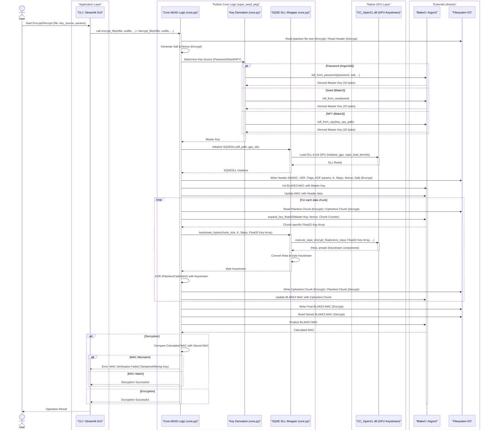

```mermaid
sequenceDiagram
    actor User
    box "Application Layer"
        participant CLI_GUI as "CLI / Streamlit GUI"
    end

    box "Python Core Logic (sqse_aead_pkg)"
        participant Core_AEAD_Logic as "Core AEAD Logic (core.py)"
        participant Key_Derivation as "Key Derivation (core.py)"
        participant SQSE_DLL_Wrapper as "SQSE DLL Wrapper (core.py)"
    end

    box "Native GPU Layer"
        participant CC_OpenCL_DLL as "CC_OpenCL.dll (GPU Keystream)"
    end

    box "External Libraries"
        participant External_Crypto_Libs as "Blake3 / Argon2"
        participant Filesystem as "Filesystem I/O"
    end

    User->>CLI_GUI: Start Encrypt/Decrypt (file, key_source, params)

    CLI_GUI->>Core_AEAD_Logic: call encrypt_file(infile, outfile, ...) / decrypt_file(infile, outfile, ...)
    activate Core_AEAD_Logic

    Core_AEAD_Logic->>Filesystem: Read plaintext file size (Encrypt) / Read Header (Decrypt)
    Core_AEAD_Logic->>Core_AEAD_Logic: Generate Salt & Nonce (Encrypt)

    Core_AEAD_Logic->>Key_Derivation: Determine Key Source (Password/Seed/NPY)
    activate Key_Derivation
    alt Password (Argon2id)
        Key_Derivation->>External_Crypto_Libs: kdf_from_password(password, salt, ...)
        External_Crypto_Libs-->>Key_Derivation: Derived Master Key (32 bytes)
    else Seed (Blake3)
        Key_Derivation->>External_Crypto_Libs: kdf_from_seed(seed)
        External_Crypto_Libs-->>Key_Derivation: Derived Master Key (32 bytes)
    else NPY (Blake3)
        Key_Derivation->>External_Crypto_Libs: kdf_from_npy(key_npy_path)
        External_Crypto_Libs-->>Key_Derivation: Derived Master Key (32 bytes)
    end
    Key_Derivation-->>Core_AEAD_Logic: Master Key
    deactivate Key_Derivation

    Core_AEAD_Logic->>SQSE_DLL_Wrapper: Initialize SQSEDLL(dll_path, gpu_idx)
    activate SQSE_DLL_Wrapper
    SQSE_DLL_Wrapper->>CC_OpenCL_DLL: Load DLL & Init GPU (initialize_gpu, sqse_load_kernels)
    activate CC_OpenCL_DLL
    CC_OpenCL_DLL-->>SQSE_DLL_Wrapper: DLL Ready
    deactivate CC_OpenCL_DLL
    SQSE_DLL_Wrapper-->>Core_AEAD_Logic: SQSEDLL Instance
    deactivate SQSE_DLL_Wrapper

    Core_AEAD_Logic->>Filesystem: Write Header (MAGIC, VER, Flags, KDF params, K, Steps, Nonce, Salt) (Encrypt)
    Core_AEAD_Logic->>External_Crypto_Libs: Init BLAKE3 MAC with Master Key
    activate External_Crypto_Libs
    Core_AEAD_Logic->>External_Crypto_Libs: Update MAC with Header data

    loop For each data chunk
        Core_AEAD_Logic->>Filesystem: Read Plaintext Chunk (Encrypt) / Ciphertext Chunk (Decrypt)
        
        Core_AEAD_Logic->>External_Crypto_Libs: expand_key_float32(Master Key, Nonce, Chunk Counter)
        External_Crypto_Libs-->>Core_AEAD_Logic: Chunk-specific Float32 Key Array

        Core_AEAD_Logic->>SQSE_DLL_Wrapper: keystream_bytes(chunk_size, K, Steps, Float32 Key Array)
        activate SQSE_DLL_Wrapper
        SQSE_DLL_Wrapper->>CC_OpenCL_DLL: execute_sqse_encrypt_float(zeros_input, Float32 Key Array, ...)
        activate CC_OpenCL_DLL
        CC_OpenCL_DLL-->>SQSE_DLL_Wrapper: theta, pmask (Keystream components)
        deactivate CC_OpenCL_DLL
        SQSE_DLL_Wrapper->>SQSE_DLL_Wrapper: Convert theta to byte Keystream
        SQSE_DLL_Wrapper-->>Core_AEAD_Logic: Byte Keystream
        deactivate SQSE_DLL_Wrapper

        Core_AEAD_Logic->>Core_AEAD_Logic: XOR (Plaintext/Ciphertext) with Keystream
        Core_AEAD_Logic->>Filesystem: Write Ciphertext Chunk (Encrypt) / Plaintext Chunk (Decrypt)
        Core_AEAD_Logic->>External_Crypto_Libs: Update BLAKE3 MAC with Ciphertext Chunk
    end

    Core_AEAD_Logic->>Filesystem: Write Final BLAKE3 MAC (Encrypt)
    Core_AEAD_Logic->>Filesystem: Read Stored BLAKE3 MAC (Decrypt)
    Core_AEAD_Logic->>External_Crypto_Libs: Finalize BLAKE3 MAC
    External_Crypto_Libs-->>Core_AEAD_Logic: Calculated MAC

    alt Decryption
        Core_AEAD_Logic->>Core_AEAD_Logic: Compare Calculated MAC with Stored MAC
        alt MAC Mismatch
            Core_AEAD_Logic--xCLI_GUI: Error: MAC Verification Failed (Tampered/Wrong Key)
        else MAC Match
            Core_AEAD_Logic-->>CLI_GUI: Decryption Successful
        end
    else Encryption
        Core_AEAD_Logic-->>CLI_GUI: Encryption Successful
    end
    deactivate External_Crypto_Libs
    deactivate Core_AEAD_Logic
    CLI_GUI-->>User: Operation Result
```