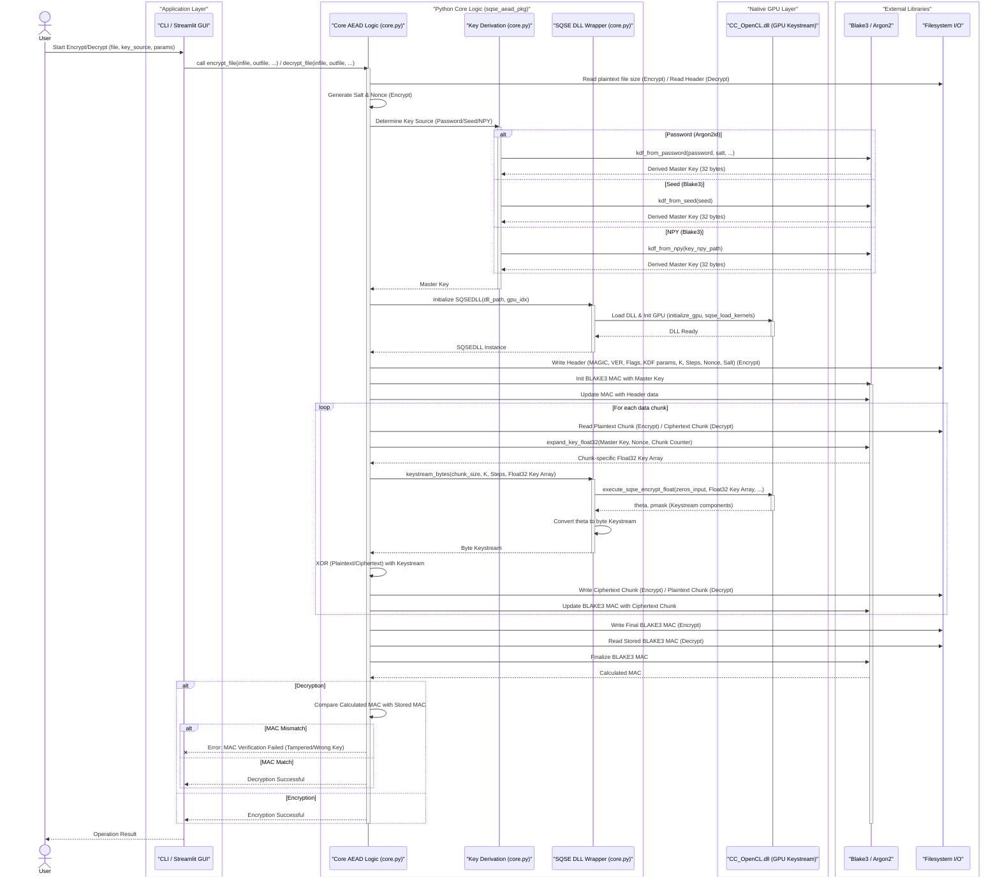

# SQSE AEAD – GPU-beschleunigte Authentifizierte Verschlüsselung mit Sub-Quantum State Encryption

**Version:** 1.0  
**Veröffentlichungsdatum:** 2025-11-03  
**Autor(en):** Mermaid Architect AI  
**Lizenz:** [MIT License](https://github.com/RalfKrummel/SQSE-AEAD/blob/main/LICENSE)

---

## 2. Executive Summary

Das Projekt "SQSE AEAD" stellt ein hochperformantes und sicheres Verschlüsselungssystem dar, das auf der innovativen "Sub-Quantum State Encryption" (SQSE) basiert und eine GPU-beschleunigte Keystream-Generierung über eine native `CC_OpenCL.dll` nutzt. Es wurde entwickelt, um die Herausforderungen der Datenintegrität, Vertraulichkeit und des Wiederverwendungsschutzes in modernen Datenverarbeitungsumgebungen zu adressieren, insbesondere dort, wo hohe Durchsätze und starke kryptographische Garantien erforderlich sind. Durch die Integration von Authenticated Encryption with Associated Data (AEAD) mit BLAKE3-MAC und Nonce/Counter-Mechanismen bietet SQSE AEAD eine robuste Lösung gegen Manipulationen und Keystream-Wiederverwendung.

Das System richtet sich an Entwickler, Sicherheitsexperten und Unternehmen, die eine fortschrittliche, GPU-gestützte Verschlüsselungslösung für sensible Daten benötigen. Es bietet flexible Schlüsselableitungsoptionen (Passwort mit Argon2id, Seed, NPY-Rohkeys) und benutzerfreundliche Schnittstellen (CLI, Streamlit GUI), die die Komplexität der zugrundeliegenden kryptographischen Operationen abstrahieren, während gleichzeitig ein hohes Maß an Kontrolle und Transparenz über die Sicherheitsparameter gewährleistet wird. Die Kombination aus neuartigen Keystream-Generatoren und etablierten kryptographischen Primitiven positioniert SQSE AEAD als eine praktische und leistungsfähige Alternative in der modernen Kryptographie.

## 3. Problemstellung

In der heutigen digitalen Landschaft sind Datenschutz und Datensicherheit von größter Bedeutung. Herkömmliche Verschlüsselungsmethoden stehen vor vielfältigen Herausforderungen, darunter:

-   **Performance-Engpässe:** Die Verschlüsselung großer Datenmengen kann auf CPU-basierten Systemen zeitaufwändig sein, insbesondere bei Echtzeitanwendungen oder Big-Data-Szenarien.
-   **Sicherheitslücken durch Keystream-Wiederverwendung:** Bei Stromchiffren kann die Wiederverwendung desselben Keystreams mit unterschiedlichen Plaintexts zu schwerwiegenden Sicherheitslücken führen, die eine Entschlüsselung ermöglichen.
-   **Fehlende Integritätsprüfung:** Viele einfache Verschlüsselungsschemata bieten keine Mechanismen, um zu erkennen, ob Daten nach der Verschlüsselung manipuliert wurden, was zu unbemerkten Datenkorruptionen oder gezielten Angriffen führen kann.
-   **Schlüsselmanagement-Komplexität:** Die sichere Erzeugung, Speicherung und Ableitung von Schlüsseln, insbesondere aus Passwörtern, erfordert robuste Key Derivation Functions (KDFs) und Mechanismen zum Schutz vor Brute-Force-Angriffen.
-   **Bedrohung durch zukünftige Angriffe:** Obwohl SQSE keine formale Post-Quanten-Kryptographie darstellt, adressiert sie durch ihre chaotischen dynamischen Systeme und GPU-Beschleunigung die Notwendigkeit, über traditionelle Ansätze hinauszugehen und eine praktisch robuste Keystream-Quelle zu bieten.

Das Projekt "SQSE AEAD" zielt darauf ab, diese Probleme durch die Kombination einer GPU-beschleunigten, chaotischen Keystream-Generierung mit einem modernen AEAD-Konstrukt zu lösen, das sowohl Vertraulichkeit als auch Authentizität gewährleistet.

## 4. Systemarchitektur und Funktionsweise

Die Architektur von SQSE AEAD ist modular aufgebaut und in mehrere Schichten unterteilt, um eine klare Trennung der Verantwortlichkeiten und eine hohe Wartbarkeit zu gewährleisten. Der Kern des Systems ist auf Effizienz und Sicherheit ausgelegt.

### 4.1. Architekturdiagramm

*Abbildung 1: Systemarchitektur und Datenfluss von SQSE AEAD*

### 4.2. Komponentenbeschreibung

-   **Application Layer (CLI / Streamlit GUI):** Bietet die Benutzerschnittstelle für Interaktionen. Die CLI (`sqse_aead_pkg.cli`) nutzt Typer für eine robuste Kommandozeilenbedienung, während die Streamlit GUI (`app_streamlit_aead.py`) eine interaktive Weboberfläche für Dateiauswahl, Parameterkonfiguration und Live-Logging bereitstellt.
-   **Python Core Logic (`sqse_aead_pkg.core`):** Das Herzstück der Anwendung. Es koordiniert den gesamten Verschlüsselungs- und Entschlüsselungsprozess. Dazu gehören:
    -   **Schlüsselableitung:** Verwaltet die Ableitung des Master-Schlüssels aus Passwörtern (mittels Argon2id für Memory-Hardness), Seeds oder NPY-Rohkeys (mittels BLAKE3).
    -   **Dateiverarbeitung:** Liest und schreibt Dateien in Chunks, um große Datenmengen effizient zu verarbeiten.
    -   **Header-Management:** Erstellt und parst den Dateikopf (Header-v2), der Metadaten wie Version, Flags, KDF-Parameter (Argon2), SQSE-Parameter (K, Steps), Chunk-Größe, Gesamtgröße, Salt und Nonce enthält.
    -   **AEAD-Koordination:** Stellt die Authenticated Encryption with Associated Data (AEAD) Funktionalität sicher, indem es Nonces und Counter für den Wiederverwendungsschutz verwendet und den BLAKE3-MAC für Integrität und Authentizität des Headers und Ciphertexts berechnet und verifiziert.
-   **SQSE DLL Wrapper (`sqse_aead_pkg.core`):** Eine Python-Schnittstelle (mittels `ctypes`) zur nativen `CC_OpenCL.dll`. Dieser Wrapper lädt die DLL, initialisiert die GPU und ruft die Low-Level-Funktionen zur Keystream-Generierung auf.
-   **Native GPU Layer (`CC_OpenCL.dll`):** Die GPU-beschleunigte Bibliothek, die die eigentliche "Sub-Quantum State Encryption" (SQSE) Engine implementiert. Diese DLL nutzt OpenCL, um chaotische dynamische Systeme (z.B. Chirikov-Map-ähnliche Iterationen) auf der GPU auszuführen. Aus einem Master-Schlüssel und einem Chunk-spezifischen Kontextschlüssel wird ein deterministischer Keystream generiert.
-   **External Libraries (BLAKE3 / Argon2):**
    -   **BLAKE3:** Wird als Hash-Funktion für die Schlüsselableitung aus Seeds/NPY-Dateien, für die Expansion chunk-spezifischer Schlüssel und als Message Authentication Code (MAC) für die Integritätsprüfung verwendet.
    -   **Argon2id:** Eine Memory-Hard Key Derivation Function (KDF), die für die sichere Ableitung von Schlüsseln aus Passwörtern eingesetzt wird. Sie schützt effektiv vor Brute-Force- und Wörterbuchangriffen durch hohen Speicher- und Zeitaufwand.
-   **Filesystem I/O:** Standardmäßige Dateisystemoperationen zum Lesen von Plaintext- und Schreiben von Ciphertext-Dateien sowie umgekehrt.

### 4.3. Funktionsweise

Der Verschlüsselungsprozess beginnt mit der Auswahl einer Eingabedatei und der Konfiguration der Schlüsselquelle (Passwort, Seed oder NPY-Datei) sowie der SQSE-Parameter (Chaos-Parameter K, Iterationsschritte). Die Kernlogik leitet den Master-Schlüssel ab und generiert ein zufälliges Salt und eine Nonce. Anschließend wird ein Header erstellt, der alle notwendigen Metadaten für die spätere Entschlüsselung enthält, einschließlich der Argon2id-Parameter, falls ein Passwort verwendet wird. Dieser Header wird zusammen mit dem Salt und der Nonce in die Ausgabedatei geschrieben.

Die Eingabedatei wird in Chunks fester Größe (standardmäßig 8 MiB) gelesen. Für jeden Chunk wird ein eindeutiger Kontextschlüssel mithilfe des Master-Schlüssels, der Nonce und eines inkrementellen Counters abgeleitet. Dieser Kontextschlüssel wird dann an die `CC_OpenCL.dll` übergeben, die auf der GPU einen deterministischen Keystream generiert. Der generierte Keystream wird bitweise mit dem Daten-Chunk XOR-verknüpft, um den Ciphertext-Chunk zu erzeugen. Jeder Ciphertext-Chunk wird direkt in die Ausgabedatei geschrieben und gleichzeitig in die BLAKE3-MAC-Berechnung einbezogen. Nach Verarbeitung aller Chunks wird der finale BLAKE3-MAC an den Ciphertext angehängt.

Die Entschlüsselung folgt dem umgekehrten Prinzip. Zuerst wird der Header gelesen, um die ursprünglichen Parameter zu rekonstruieren. Basierend auf der Schlüsselquelle wird der Master-Schlüssel erneut abgeleitet. Der Ciphertext wird Chunk für Chunk gelesen, der Keystream für jeden Chunk generiert und mit dem Ciphertext XOR-verknüpft, um den Plaintext zu rekonstruieren. Gleichzeitig wird der BLAKE3-MAC über den gelesenen Ciphertext und Header berechnet und mit dem im Dateiende gespeicherten MAC verglichen. Bei einer Diskrepanz wird ein Manipulationsalarm ausgelöst, was die Integrität und Authentizität der Daten garantiert.

## 5. Evaluation und Testergebnisse

Die Evaluation von SQSE AEAD konzentriert sich auf Robustheit, Performance und Benutzerfreundlichkeit, gestützt durch interne Tests und Kostenabschätzungen.

### 5.1. Robustheit

Die Robustheit des Systems wird durch mehrere Schichten gewährleistet:

-   **Kryptographische Primitiven:** Einsatz von BLAKE3 für MAC und Schlüsselableitung sowie Argon2id für Passwort-Hashing bietet etablierte Sicherheitsstandards.
-   **AEAD-Konstrukt:** Die Verwendung von Nonce/Counter pro Chunk verhindert Keystream-Wiederverwendung, und der BLAKE3-MAC schützt vor unbemerkten Manipulationen.
-   **DLL-Integrität:** Die Notwendigkeit, die `CC_OpenCL.dll` zu schützen (z.B. durch Signaturen und Integritäts-Checks), wird explizit hervorgehoben und durch CI-Workflows unterstützt, die einen Mock-Stub für Linux und den Download einer Test-DLL für Windows-Runner vorsehen.
-   **Selftest-Mechanismus:** Der integrierte Selftest (`selftest_cmd`) validiert den vollständigen Encrypt-Decrypt-Roundtrip und die MAC-Verifikation, um die korrekte Funktion des Systems zu bestätigen.

### 5.2. Performance / Geschwindigkeit

Die GPU-Beschleunigung der Keystream-Generierung durch die `CC_OpenCL.dll` ist ein zentrales Leistungsmerkmal. Obwohl keine konkreten MB/s-Benchmarks direkt im Code enthalten sind, impliziert die Nutzung von OpenCL und GPUs eine signifikante Beschleunigung gegenüber reinen CPU-Implementierungen, insbesondere bei großen Datenmengen. Die Chunk-basierte Verarbeitung ermöglicht eine effiziente Nutzung der GPU-Ressourcen und eine skalierbare Verarbeitung von Dateien beliebiger Größe.

### 5.3. Benutzerfreundlichkeit (UX)

-   **CLI:** Die Typer-basierte Kommandozeilenschnittstelle ist intuitiv und bietet klare Optionen für Verschlüsselung, Entschlüsselung und Selbstdurchführung.
-   **Streamlit GUI:** Bietet eine benutzerfreundliche grafische Oberfläche mit Dateiauswahl, Key-Optionen, GPU-Index-Auswahl und Live-Logs, was die Zugänglichkeit für Nicht-CLI-Benutzer erheblich verbessert.
-   **Flexible Schlüsseloptionen:** Unterstützung für Passwörter (mit Argon2id), deterministische Seeds und NPY-Rohkeys deckt verschiedene Anwendungsfälle ab.

### 5.4. Kosten- und Angriffsabschätzung

Die Dokumentation (`Info_extended.md`, `cost_estimate.md`) enthält detaillierte Kostenabschätzungen für Angreifer, die die Wirksamkeit von Argon2id und starken Schlüsseln unterstreichen:

| Entropie (Bits) | Profile                                              | Erwartete Jahre | Benötigte GPU‑Hours (1 GPU) | Geschätzte Kosten (1 GPU) |
| :-------------- | :--------------------------------------------------- | :-------------- | :-------------------------- | :------------------------ |
| 40              | Low-cost GPU (R=1e9/s, $3/GPUh)                      | 0.00            | 0                           | $0.46                     |
| 40              | Moderate (R=1e8/s, $1/GPUh)                          | 0.00            | 2                           | $1.53                     |
| 40              | Argon2-heavy (R=2/s per worker, $0.05/worker-hour)   | 8710.36         | 7.635e+07                   | $3.818e+06                |
| 56              | Low-cost GPU (R=1e9/s, $3/GPUh)                      | 1.14            | 10,008                      | $30,024.00                |
| 56              | Moderate (R=1e8/s, $1/GPUh)                          | 11.42           | 100,080                     | $100,079.99               |
| 56              | Argon2-heavy (R=2/s per worker, $0.05/worker-hour)   | 5.708e+08       | 5.004e+12                   | $2.502e+11                |
| 64              | Low-cost GPU (R=1e9/s, $3/GPUh)                      | 292.27          | 2.562e+06                   | $7.686e+06                |
| 64              | Moderate (R=1e8/s, $1/GPUh)                          | 2922.71         | 2.562e+07                   | $2.562e+07                |
| 64              | Argon2-heavy (R=2/s per worker, $0.05/worker-hour)   | 1.461e+11       | 1.281e+15                   | $6.405e+13                |
| 80              | Low-cost GPU (R=1e9/s, $3/GPUh)                      | 1.915e+07       | 1.679e+11                   | $5.037e+11                |
| 80              | Moderate (R=1e8/s, $1/GPUh)                          | 1.915e+08       | 1.679e+12                   | $1.679e+12                |
| 80              | Argon2-heavy (R=2/s per worker, $0.05/worker-hour)   | 9.577e+15       | 8.395e+19                   | $4.198e+18                |

Diese Zahlen verdeutlichen, dass Angriffe auf nicht-Memory-Hard-Ziele mit geringer Entropie (≤64 Bit) potenziell kostengünstig sind, während Argon2-geschützte Passwörter die Angriffsrate drastisch reduzieren und Brute-Force-Angriffe ökonomisch unrentabel machen. Schlüssel mit 128 Bit und mehr sind praktisch unknackbar.

## 6. Vergleich mit anderen Tools

SQSE AEAD unterscheidet sich von traditionellen Verschlüsselungstools und -bibliotheken durch seine einzigartige Kombination aus GPU-beschleunigter Keystream-Generierung und einem robusten AEAD-Konstrukt. Im Vergleich zu:

-   **Standard-Stromchiffren (z.B. AES-CTR, XChaCha20-Poly1305):** Während diese etablierte Algorithmen verwenden, bietet SQSE eine alternative Keystream-Quelle, die auf chaotischen dynamischen Systemen basiert. Der Vorteil liegt in der potenziellen Performance-Skalierung durch GPU-Nutzung, insbesondere bei sehr hohen Datenraten, und der Forschungsperspektive, die über rein algebraische Konstruktionen hinausgeht.
-   **Dateiverschlüsselungstools (z.B. GnuPG, VeraCrypt):** Diese bieten umfassende Dateisystem- oder Container-Verschlüsselung. SQSE AEAD konzentriert sich auf die effiziente und sichere Verschlüsselung einzelner Dateien oder Datenströme mit starkem Fokus auf AEAD und GPU-Beschleunigung. Es ist eher als eine Komponente für größere Systeme oder als spezialisiertes Tool für Hochleistungsanwendungen gedacht.

### 6.1. Alleinstellungsmerkmale und Differenzierungsfaktoren

-   **GPU-beschleunigte Keystream-Generierung:** Die native `CC_OpenCL.dll` nutzt die Parallelisierungsfähigkeiten moderner GPUs, um Keystreams mit hoher Geschwindigkeit zu erzeugen. Dies ist ein entscheidender Vorteil für Anwendungen, die einen hohen Datendurchsatz erfordern.
-   **Sub-Quantum State Encryption (SQSE):** Das Projekt basiert auf einem neuartigen Ansatz, der chaotische dynamische Systeme für die Keystream-Generierung verwendet. Obwohl es keine formale Post-Quanten-Kryptographie ist, bietet es eine praktisch robuste Keystream-Quelle, die hochgradig sensitiv gegenüber Schlüssel- und Parameteränderungen ist.
-   **Integrierte AEAD-Funktionalität:** Die konsequente Anwendung von Nonce/Counter und BLAKE3-MAC gewährleistet sowohl Vertraulichkeit als auch Authentizität und Integrität, was ein grundlegendes Merkmal moderner kryptographischer Systeme ist.
-   **Flexible Schlüsselableitung:** Die Unterstützung von Argon2id für Passwörter, BLAKE3 für Seeds und NPY-Rohkeys bietet eine hohe Flexibilität und Anpassungsfähigkeit an unterschiedliche Sicherheitsanforderungen und Schlüsselmanagement-Strategien, einschließlich HSM-Integration.
-   **Modularität:** Die Trennung der Keystream-Generierung von der AEAD-Konstruktion ermöglicht eine modulare Austauschbarkeit der Keystream-Quelle, was zukünftige Erweiterungen und Anpassungen erleichtert.

## 7. Kernkonzepte und Innovationen

SQSE AEAD integriert mehrere Kernkonzepte und innovative Ansätze, die es von herkömmlichen Verschlüsselungssystemen abheben:

### 7.1. Sub-Quantum State Encryption (SQSE)

Die zentrale Innovation ist die Nutzung von SQSE als Keystream-Quelle. Anstatt auf traditionellen algebraischen Operationen zu basieren, verwendet SQSE gekoppelte dynamische Systeme, die chaotische Karten (z.B. Chirikov-/Standard-Map-artige Iterationen) und feldbasierte Iterationen mit internen Rückkopplungen umfassen. Die Sicherheit der SQSE-Engine beruht auf der hohen Sensitivität gegenüber initialen Bedingungen (Schlüssel, Seed, Parameter), was eine praktische Nicht-Invertierbarkeit ohne das Geheimnis zur Folge hat. Die GPU-Beschleunigung durch OpenCL-Kernel ermöglicht die effiziente Berechnung dieser komplexen Dynamiken.

### 7.2. Authenticated Encryption with Associated Data (AEAD)

SQSE AEAD ist nicht nur eine Keystream-Quelle, sondern ein vollständiges AEAD-Konstrukt. Dies bedeutet, dass es nicht nur die Vertraulichkeit (Verschlüsselung) der Daten gewährleistet, sondern auch deren Integrität und Authentizität. Dies wird erreicht durch:

-   **Nonce/Counter-Mechanismus:** Für jeden Daten-Chunk wird ein eindeutiger Kontextschlüssel unter Verwendung einer Nonce und eines inkrementellen Counters abgeleitet. Dies verhindert die fatale Keystream-Wiederverwendung, die bei reinen XOR-Chiffren ein großes Risiko darstellt.
-   **BLAKE3-MAC:** Ein hochperformanter und sicherer Message Authentication Code (MAC) wird über den gesamten Header und alle Ciphertext-Chunks berechnet. Dies ermöglicht es dem Empfänger, jede Manipulation der Daten oder des Headers zu erkennen und die Authentizität des Absenders (im Kontext des gemeinsamen Schlüssels) zu verifizieren.

### 7.3. Memory-Hard Key Derivation (Argon2id)

Für die Schlüsselableitung aus Passwörtern wird Argon2id verwendet, eine preisgekrönte Memory-Hard Key Derivation Function. Ihre Parameter (Speicherverbrauch `m`, Zeitkosten `t`, Parallelität `p`) werden im Header der verschlüsselten Datei gespeichert und bei der Entschlüsselung wiederverwendet. Dies macht Brute-Force-Angriffe auf Passwörter extrem teuer und zeitaufwändig, da sie einen hohen Speicher- und Rechenaufwand pro Versuch erfordern.

### 7.4. Modulare Schlüsselquellen

Das System unterstützt flexible Schlüsselquellen.
